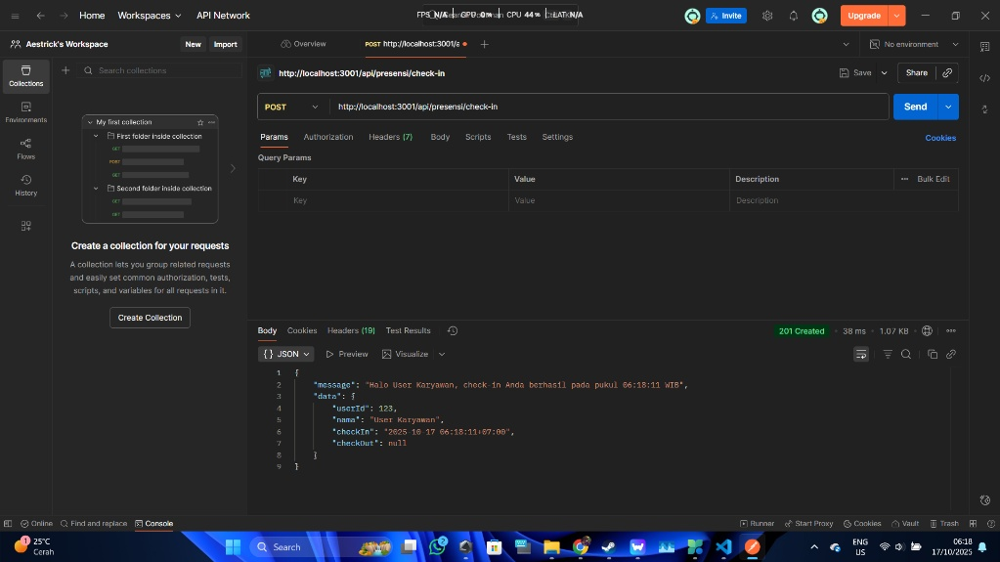
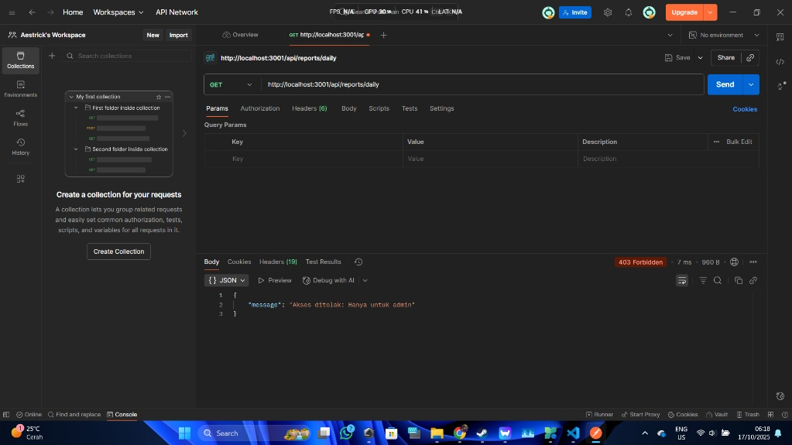
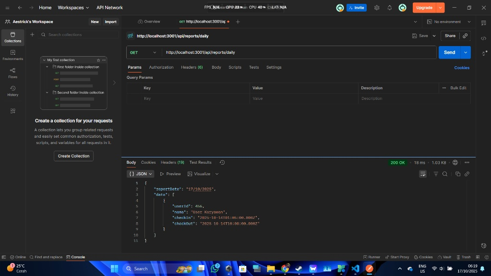

# Laporan Tugas Praktikum 3: Routing & Middleware

Berikut adalah hasil pengujian endpoint API Presensi (versi in-memory/array).

### 1. Presensi Check-in (Berhasil)

### 2. Presensi Check-out (Berhasil)

### 3. Laporan Harian (Gagal sebagai Karyawan)

### 4. Laporan Harian (Berhasil sebagai Admin)
