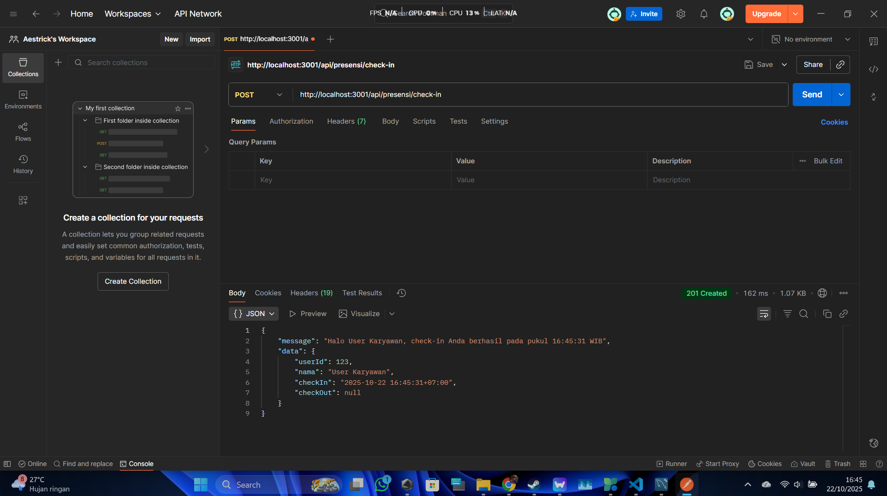
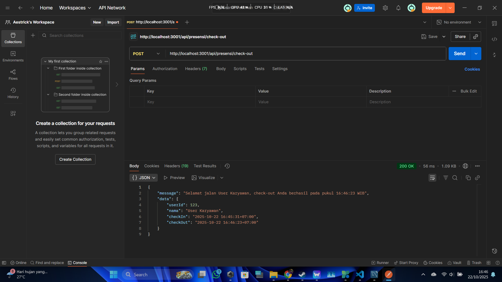
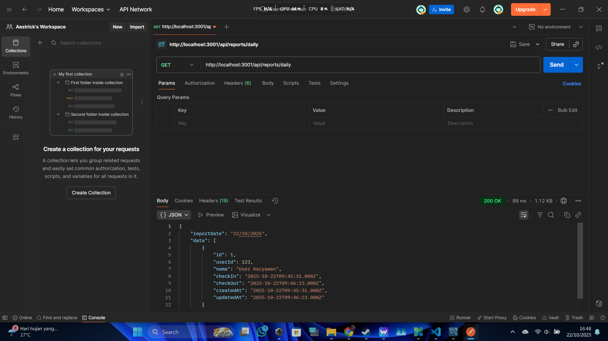
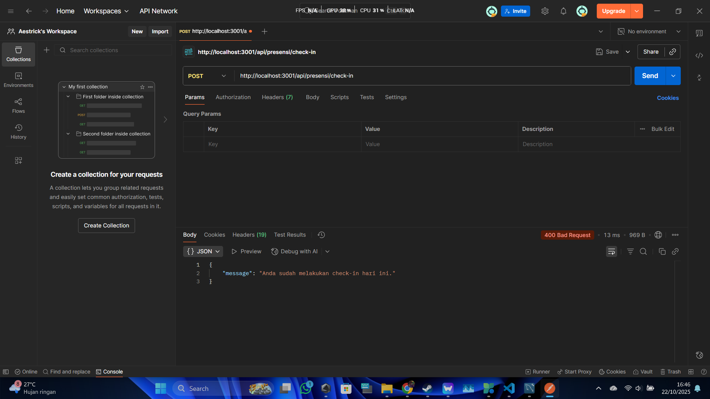
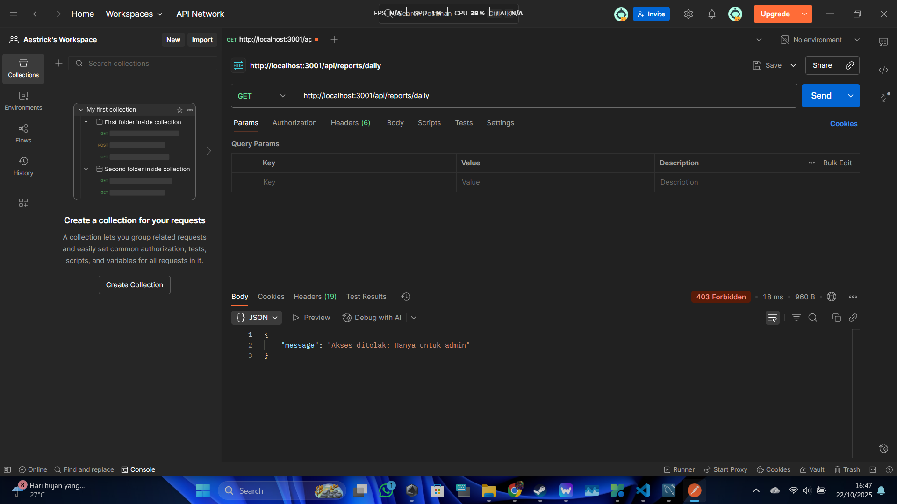
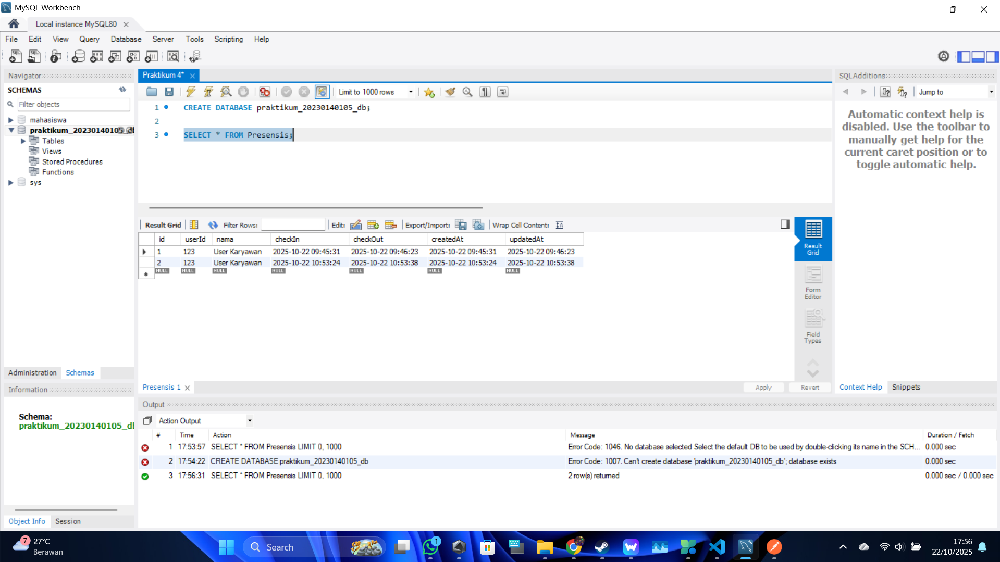

# Laporan Tugas Praktikum 4: Koneksi Database Sequelize

Berikut adalah hasil pengujian endpoint API Presensi setelah dihubungkan ke database MySQL menggunakan Sequelize.

### 1. Endpoint Presensi Check-in

### 2. Endpoint Presensi Check-out

### 3. Endpoint Laporan Harian (Sebagai Admin)

---

## Skenario Error Handling

#### Check-in Gagal (Duplikat)

#### Check-out Gagal (Belum Check-in)

#### Laporan Gagal (Sebagai Karyawan)

---

### 4. Tampilan Database Setelah Presensi
(Screenshot database-mu akan diletakkan di sini, pastikan filenya ada di dalam folder `SS` juga)
