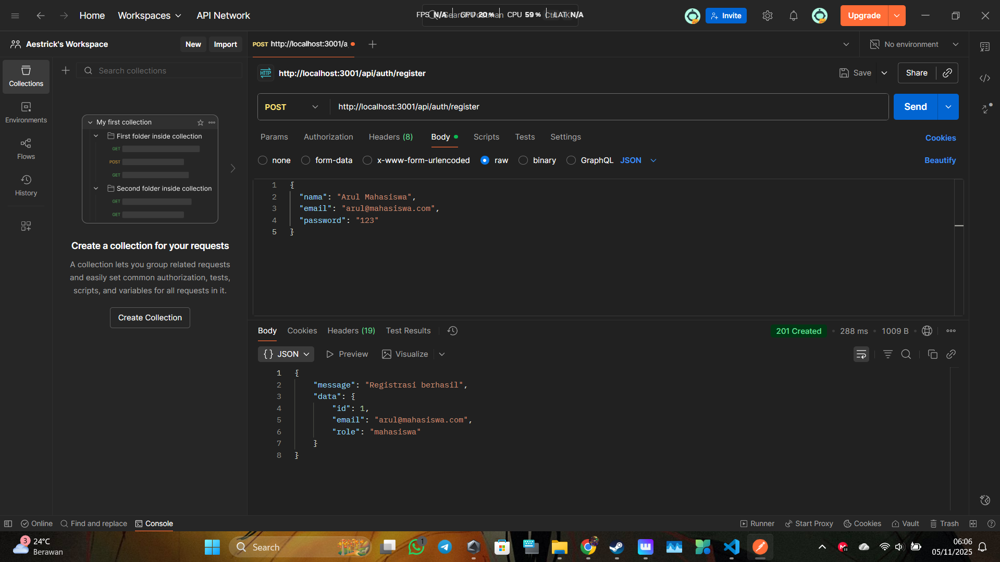
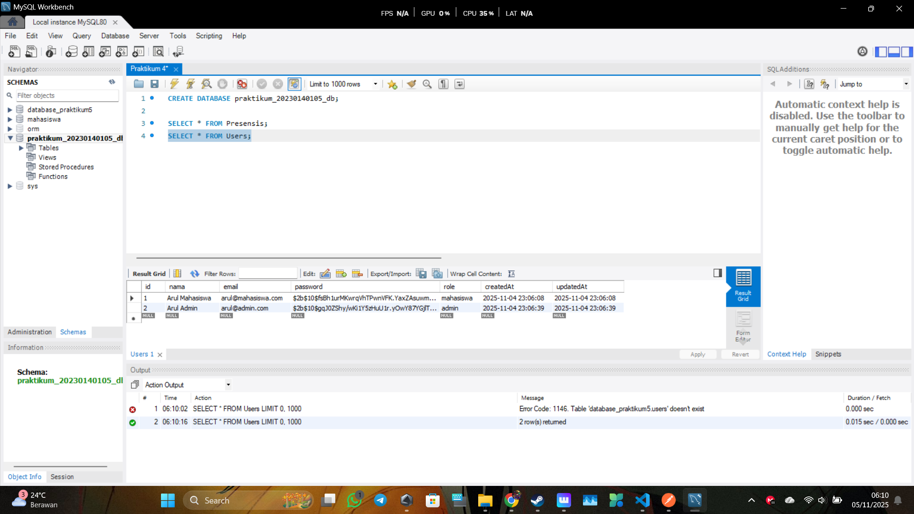

# Laporan Tugas Praktikum 6: Autentikasi API (JWT & Bcrypt)

Berikut adalah hasil pengujian endpoint API Autentikasi yang baru.

### 1. Request POST /register (User "mahasiswa")
Hasil registrasi user baru dengan role default 'mahasiswa'. Server merespon dengan `201 Created`.

---

### 2. Request POST /register (User "admin")
Hasil registrasi user baru dengan role 'admin' yang diset secara manual di body. Server merespon dengan `201 Created`.

---

### 3. Request POST /login (Login sebagai "mahasiswa")
Hasil login menggunakan email dan password mahasiswa. Server berhasil memverifikasi dan mengembalikan `token` JWT.

---

### 4. Tampilan Database Tabel Users
Tampilan tabel `Users` di MySQL Workbench setelah kedua user berhasil diregistrasi. Ini membuktikan data tersimpan dan password berhasil di-hash (terlihat sebagai teks acak).

